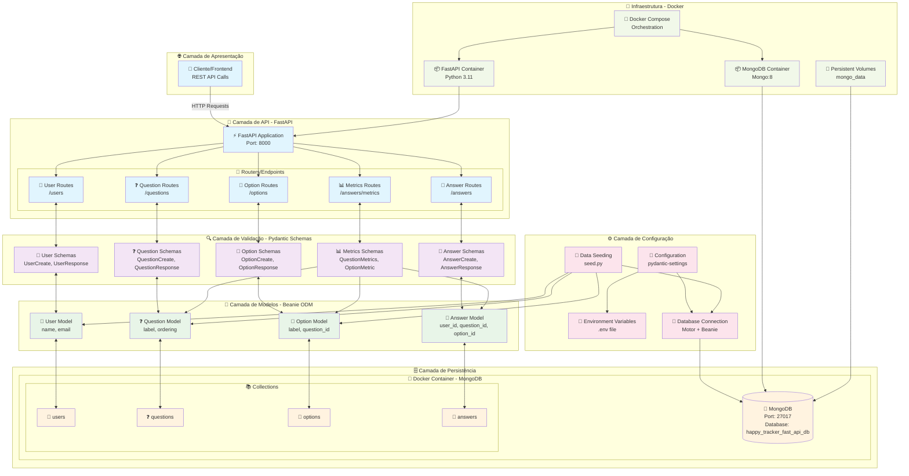

# 🏗️ Arquitetura do HappyTracker API

## Diagrama de Arquitetura



## 📋 Resumo da Arquitetura

### 🎯 Padrão Arquitetural
**Clean Architecture** + **Domain-Driven Design**

### 🏗️ Camadas da Aplicação

1. **🌐 Camada de Apresentação**
   - Interface REST API via FastAPI
   - Documentação automática (Swagger/OpenAPI)

2. **📍 Camada de Rotas/Controllers**
   - 4 routers principais: Users, Questions, Options, Answers
   - Endpoints especializados para métricas e análises

3. **🔍 Camada de Validação**
   - Schemas Pydantic para validação de entrada/saída
   - Tipagem forte e validação automática

4. **🧠 Camada de Modelos/Domínio**
   - Models Beanie (ODM para MongoDB)
   - Relacionamentos entre entidades

5. **🗄️ Camada de Persistência**
   - MongoDB como banco de dados NoSQL
   - Collections organizadas por domínio

### 🔗 Relacionamentos Entre Entidades

```
User (1) ←→ (N) Answer (N) ←→ (1) Question
                      ↓
                 (N) ←→ (1) Option
```

### 🚀 Stack Tecnológica

- **Framework**: FastAPI + Uvicorn
- **ODM**: Beanie (sobre Motor/PyMongo)
- **Banco**: MongoDB 8
- **Validação**: Pydantic
- **Containerização**: Docker + Docker Compose
- **Linguagem**: Python 3.11

### 📊 Funcionalidades Principais

- ✅ **CRUD** completo para Users, Questions, Options, Answers
- ✅ **Métricas avançadas** de respostas e engajamento
- ✅ **Sistema de logs** para auditoria
- ✅ **Seeding automático** de dados iniciais
- ✅ **Relacionamentos** complexos entre entidades

### 🎯 Endpoints da API

#### 👤 Users
- `POST /users` - Criar usuário
- `GET /users` - Listar usuários
- `GET /users/{user_id}` - Buscar usuário específico

#### ❓ Questions
- `POST /questions` - Criar questão
- `GET /questions` - Listar questões (ordenadas)
- `GET /questions/{question_id}` - Buscar questão com opções

#### 📝 Options
- `POST /options` - Criar opção
- `GET /options/by-question/{question_id}` - Listar opções por questão

#### 💬 Answers
- `POST /answers` - Criar resposta
- `GET /answers` - Listar todas as respostas
- `GET /answers/by-user/{user_id}` - Buscar respostas por usuário

#### 📊 Metrics
- `GET /answers/metrics/all` - Métricas de todas as questões com respostas
- Filtra apenas questões e opções que receberam respostas

### 🐳 Como Executar

```bash
# Subir containers
docker compose up -d

# Ver logs
docker compose logs -f

# Parar containers
docker compose down
```

### 📖 Acesso à Documentação
- **Swagger UI**: http://localhost:8000/docs
- **ReDoc**: http://localhost:8000/redoc